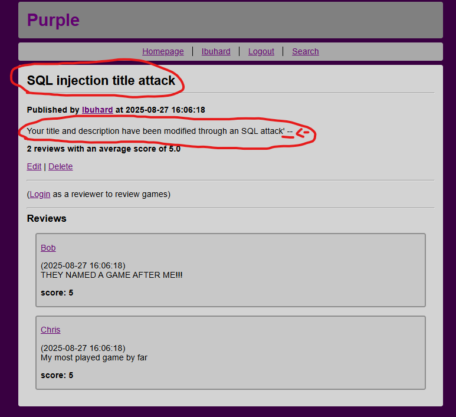

# Game website (Purple) with 5 security flaws
LINK: [Game website (Purple) with 5 security flaws](https://github.com/ChrisKK04/game-website-5-flaws)  
INFO: The project was built using SQLite, Flask and Python for a previous course. The original, non-modified version, can be found at [Purple](https://github.com/ChrisKK04/game-website).  
DESCRIPTION: The website is a site where publishers can post games and users can leave reviews for those games  
INSTALLATION: The website needs [Python](https://www.python.org/downloads/) and [SQLite](https://www.sqlite.org/download.html) to function.  

1. Create a folder for the website, copy all of the reposity files into it and open your terminal in the folder  
2. $ python3 -m venv venv (running this will initialize a python environment)  
3. $ source venv/bin/activate (activates the environment)  
4. $ pip install flask (installs flask)  
5. $ sqlite3 database.db < schema.sql (initializes the SQL database with tables)  
6. $ sqlite3 database.db < init.sql (adds categories into the database)  
7. $ flask run (runs the website)

NOTES: Additional usage instructions are included in the [README.md](https://github.com/ChrisKK04/game-website-5-flaws). The flaw-list uses the [OWASP 2017
top ten list](https://owasp.org/www-project-top-ten/2017/). The example images are included in [docs/screenshots](https://github.com/ChrisKK04/game-website-5-flaws/tree/main/docs/screenshots).  

### FLAW 1 ([A1 Injection](https://owasp.org/www-project-top-ten/2017/A1_2017-Injection)):  
[line 149 in forum.py](https://github.com/ChrisKK04/game-website-5-flaws/blob/main/forum.py#L149)  
The app has a critical SQL injection flaw related to editing game titles and descriptions. When a developer edits a game's title and description, the
SQL query that updates the values isn't using parameters properly and is directly inserting user input into the query. The flaw can be fixed by
using SQL parameters properly and not adding variables directly to queries. The fix can be implemented by removing the line in the link
and the one below and adding the next two lines.  

  &nbsp;&nbsp;Images (SQL injection game title edit example):  
    &nbsp;&nbsp;&nbsp;&nbsp;<b>Before</b>:  
      &nbsp;&nbsp;&nbsp;&nbsp;&nbsp;&nbsp;

  
      &nbsp;&nbsp;&nbsp;&nbsp;&nbsp;&nbsp;

  
      &nbsp;&nbsp;&nbsp;&nbsp;&nbsp;&nbsp;

  
    &nbsp;&nbsp;&nbsp;&nbsp;<b>After</b>:  
      &nbsp;&nbsp;&nbsp;&nbsp;&nbsp;&nbsp;

  
      &nbsp;&nbsp;&nbsp;&nbsp;&nbsp;&nbsp;

  
      &nbsp;&nbsp;&nbsp;&nbsp;&nbsp;&nbsp;

  
      &nbsp;&nbsp;&nbsp;&nbsp;&nbsp;&nbsp;

  

### FLAW 2 ([A2 Broken authentication](https://owasp.org/www-project-top-ten/2017/A2_2017-Broken_Authentication))  
[line 4 in users.py](https://github.com/ChrisKK04/game-website-5-flaws/blob/main/users.py#L4), [line 30 in users.py](https://github.com/ChrisKK04/game-website-5-flaws/blob/main/users.py#L30)
and [line 43 in users.py](https://github.com/ChrisKK04/game-website-5-flaws/blob/main/users.py#L43)  
The app is storing user passwords as plaintext without any hashing, meaning that if the database leaks, all of the user
passwords could be read directly from the database as is.
The flaw can be fixed by hashing the passwords before they're added to the database. When a user is logging in, the given password
is hashed and checked against the hash in the database. If the hash matches, the user is logged in.
The fix can be implented with werkzeug.security-modules generate_password_hash()- and check_password_hash()-functions.
The fixes can be implented by removing the comments from the import in the first link and by removing the first line and un-commenting the second
line for the two other links. The lines [line 4 in pre_data.py](https://github.com/ChrisKK04/game-website-5-flaws/blob/main/pre_data.py#L4) and
[line 103 in pre_data.py](https://github.com/ChrisKK04/game-website-5-flaws/blob/main/pre_data.py#L103) should also be added to allow pre_data.py to function with hashing.  

  &nbsp;&nbsp;Images (username, password):  
    &nbsp;&nbsp;&nbsp;&nbsp;<b>Before</b>:  
      &nbsp;&nbsp;&nbsp;&nbsp;&nbsp;&nbsp;

  
    &nbsp;&nbsp;&nbsp;&nbsp;<b>After</b>:  
      &nbsp;&nbsp;&nbsp;&nbsp;&nbsp;&nbsp;

  

### FLAW 3 ([Cross-site request forgery (CSRF)](https://owasp.org/www-community/attacks/csrf)):  
[line 42 in app.py](https://github.com/ChrisKK04/game-website-5-flaws/blob/main/app.py#L42)  
The website generates CSRF-tokens upon logins and sends them in forms but never checks them. This means that a malicious actor can steal
a session's cookies and do CSRF attacks easily by sending any CSRF-token it its requests to the server. The issue can be fixed by
adding CSRF-token checks to all parts of the app that modify data in the database. The fix can be implemented by adding the function
behind the link and adding CSRF-checks to lines [110](https://github.com/ChrisKK04/game-website-5-flaws/blob/main/app.py#L110), [267](https://github.com/ChrisKK04/game-website-5-flaws/blob/main/app.py#L267), [329](https://github.com/ChrisKK04/game-website-5-flaws/blob/main/app.py#L329), [361](https://github.com/ChrisKK04/game-website-5-flaws/blob/main/app.py#L361), [392](https://github.com/ChrisKK04/game-website-5-flaws/blob/main/app.py#L392), [466](https://github.com/ChrisKK04/game-website-5-flaws/blob/main/app.py#L466) and [504](https://github.com/ChrisKK04/game-website-5-flaws/blob/main/app.py#L504) in app.py.

  &nbsp;&nbsp;Images:  
    &nbsp;&nbsp;&nbsp;&nbsp;The flaw doesn't have images due to CSRF being hard to execute on a single machine using flask.  

### FLAW 4 ([A5 Broken access control](https://owasp.org/www-project-top-ten/2017/A5_2017-Broken_Access_Control))  
[line 379 in app.py](https://github.com/ChrisKK04/game-website-5-flaws/blob/main/app.py#L379)  
The developer forgot to add proper access control to the game edit pages, meaning that any user can edit any game listing by
accessing the editing page directly via an URL. For example, any user can type edit_game/3 into the URL and edit game 3 even
if they're not the developer (account who uploaded the game) of the game.
The issue can be fixed by checking that the username in the session matches the username of the developer of the game.
The fix is included behind the link and can be implented by removing the comments from the line behind the link and the one below.
After the fix, games can only be edited by their developer.

  &nbsp;&nbsp;Images (editing via URL):  
    &nbsp;&nbsp;&nbsp;&nbsp;<b>Before:</b>  
      &nbsp;&nbsp;&nbsp;&nbsp;&nbsp;&nbsp;

  
      &nbsp;&nbsp;&nbsp;&nbsp;&nbsp;&nbsp;

  
    &nbsp;&nbsp;&nbsp;&nbsp;<b>After:</b>  
      &nbsp;&nbsp;&nbsp;&nbsp;&nbsp;&nbsp;

  

### FLAW 5 ([A7 Cross-site scripting (XSS)](https://owasp.org/www-project-top-ten/2017/A7_2017-Cross-Site_Scripting_(XSS)))  
[line 139 in game.html](https://github.com/ChrisKK04/game-website-5-flaws/blob/main/templates/game.html#L139)  
The developer of the website wanted to allow reviewers to format their reviews with bolding, italics, etc. They implemented the feature
by using the flasks safe template-filter, which allows content to include HTML code for formatting. Critically, the safe filter also allows
JavaScript. Now a user can leave a review for a game that includes JavaScript that could potentially steal another users cookies.
The issue can be fixed by removing the safe filter and using a different one if needed.
The fix is included behind the link and can be implemented by removing the first line in the link and adding the one below it.  

  &nbsp;&nbsp;Images (XSS example alert-attack):  
    &nbsp;&nbsp;&nbsp;&nbsp;<b>Before:</b>  
      &nbsp;&nbsp;&nbsp;&nbsp;&nbsp;&nbsp;

  
      &nbsp;&nbsp;&nbsp;&nbsp;&nbsp;&nbsp;

  
    &nbsp;&nbsp;&nbsp;&nbsp;<b>After:</b>  
      &nbsp;&nbsp;&nbsp;&nbsp;&nbsp;&nbsp;

  